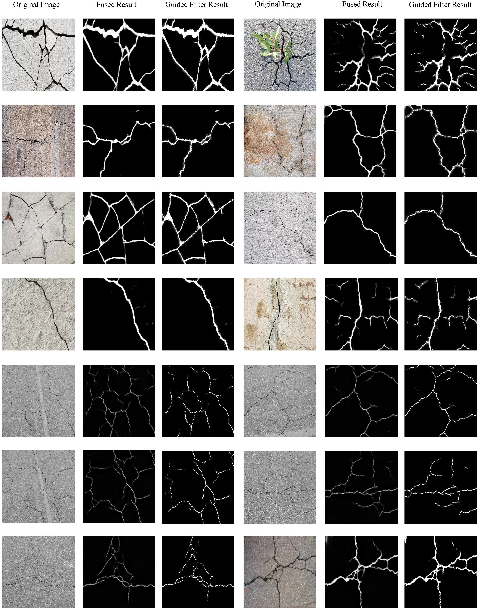
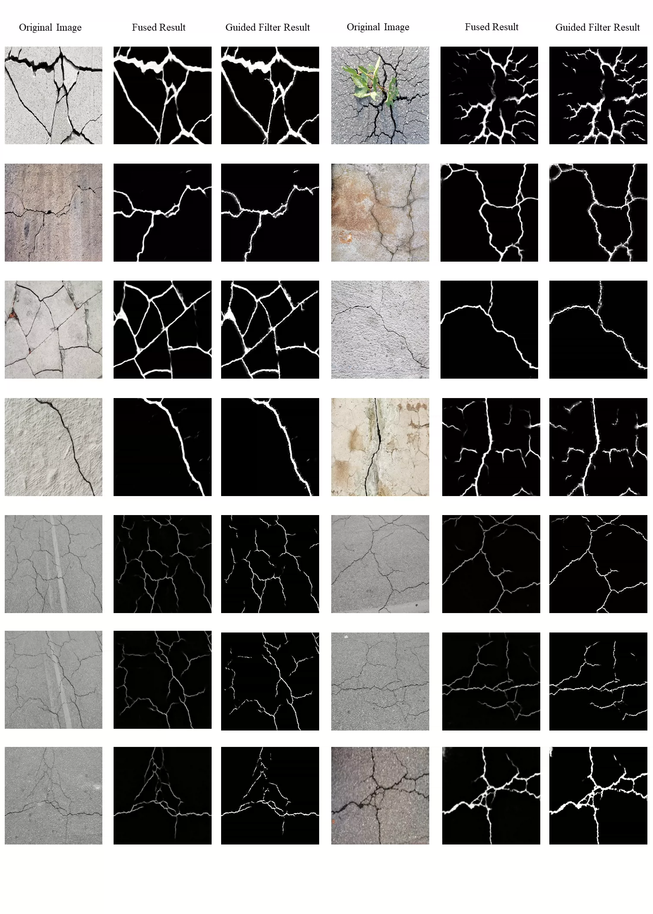
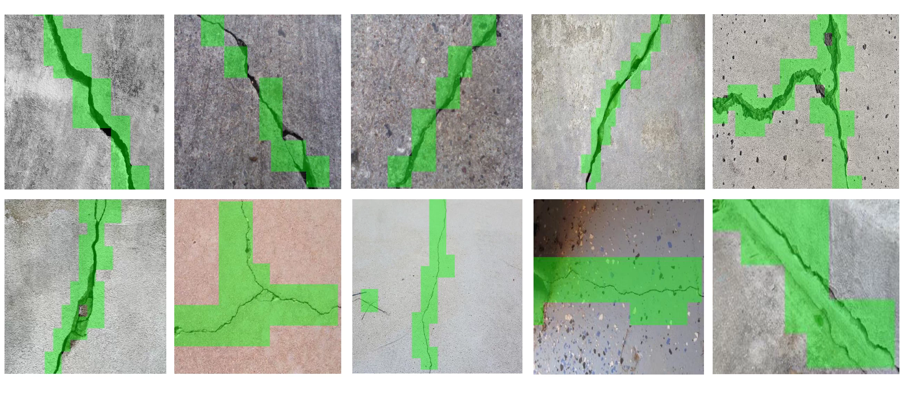
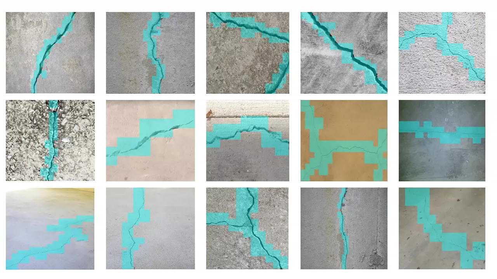
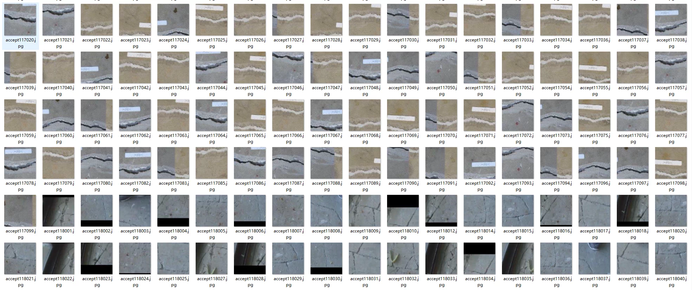

## Body

The drone crack detection and segmentation dataset, along with the author's trained models, is available for download.

【Dataset Core Information】
Designed specifically for drone infrastructure inspections, this dataset supports three major tasks: crack detection, semantic segmentation, and classification/binary classification. It covers scenarios such as sidewalks and buildings, captured from a drone perspective, closely aligning with real engineering inspection environments. It is compatible with various model trainings and greatly aids in scientific research and engineering implementation in the field of crack detection and segmentation. Additionally, it can serve as a source dataset for unsupervised domain adaptation crack segmentation.

【Core Parameters】
▪ Total sample volume: 11298 images (pixel-level fine-grained annotation, including both detection and segmentation tasks, meeting multi-scene experimental needs)
▪ Data format: Original images (JPG, RGB high-definition real-shot) + segmentation labels (JPG single-channel binary mask), no need for format conversion, directly usable
▪ Annotation rules: Mask pixel values (0=background/normal concrete, 255=crack), original images and masks are named correspondingly (mask image redundancy, some extra matches needed, precise without omission)
▪ Scenario coverage: Building wall (CW has cracks/UW does not have cracks), pavement sidewalk (CP has cracks/UP does not have cracks), covering fine cracks, web-like cracks, cross-cracks, comprehensive and diverse
▪ Environmental adaptability: Drone real-shot (high altitude panoramic view, oblique shot), including real light changes, shadow interference, slight motion blur, perfectly simulating real flight scenes, aligning with engineering actual inspection needs

【Standard Folder Hierarchy】
Crack-Dataset-UAV-Inspection/ # Root directory of the dataset
├── Crack_Segmentation_Dataset/ # Core segmentation dataset (11298 images, key for segmentation task)
│   ├── images/ # All scene original RGB images (11298 images, drone real shots)
│   └── masks/ # Fine-grained segmentation labels (named corresponding to images, detailed annotation)
├── Crack_Detection_Dataset/ # Detection sub-dataset (adapted for detection and classification tasks)
│   ├── crack_detection_dataset_1/ # Basic classification set (crack/no crack, directly adapted for binary classification)
│   ├── crack_detection_dataset_2/ # Multi-scale adaptive set (100×100/130×130, adapted for drone different flight heights)
│   └── crack_detection_dataset_3/ # SDNET multi-scene set (core scenario, categorized by pavements/building walls)
│       ├── Pavements/ (pavement: CP has cracks/UP does not have cracks)
│       └── Walls/ (building wall: CW has cracks/UW does not have cracks)
└── README.md # Official usage guide (preprocessing, reference guide, easy to use for beginners)

【Tasks and Required Operations】
【1. Semantic Segmentation】(Recommended, most commonly used, advantages of the core dataset)
▪ Usage: U-Net, DeepLabv3+, SegFormer, Mask R-CNN
▪ Required operations: No additional organization! Just uniformize the image size (512×512/640×640) + normalize (pixel/255.0), directly train, can freely do cropping, resizing, rotation, normalization and flipping preprocessing enhancements
▪ Purpose: Precisely extracting crack contours, areas, lengths, suitable for engineering defect quantification analysis, aligning with scientific research and engineering implementation needs

【2. Object Detection】(Common in drone inspection, suitable for rapid screening in engineering)
▪ Usage: YOLOv8/v9/v10, Faster R-CNN, Detectron2
▪ Required operations: Automatically extract bbox from existing mask (bounding boxes), organize into YOLO format (images+labels(txt)) or COCO format, no manual annotation required, preprocessing can be optimized as needed
▪ Purpose: Quickly locate crack positions, suitable for drone real-time inspection and rapid screening, solving the pain and danger of manual inspection

【3. Classification/Binary Classification】(Simplest, suitable for project proposal/thesis defense, baseline experiments)
▪ Usage: MobileNetV2/V3, EfficientNet, lightweight CNN
▪ Required operations: Directly classify according to folders (normal no crack/crack has crack), no complex processing required, directly import models for training, can be enhanced as needed
▪ Purpose: Quickly determine "has crack/no crack", suitable for baseline experiments, course design, scientific research initial screening, efficiently completing related tasks

Electronic virtual products sold without return or exchange

## Images

item_1041677531111

Here is a pay link on Stripe ( https://buy.stripe.com/3cs8yP7sY87d0vu9AB ). Please contact me lonlonago@foxmail.com after funding $89, and I will send you a complete data files , thank you!

